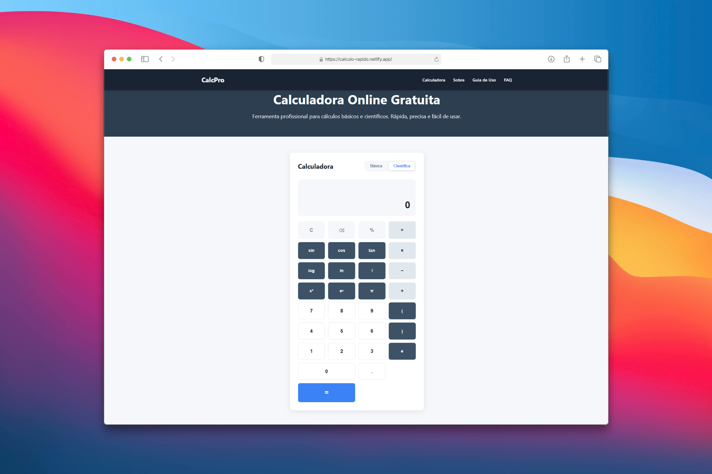

# Calculadora Online Profissional

[](https://calculo-rapido.netlify.app/)
[](https://github.com/Rodrigopcosta/Calculadora/blob/main/LICENSE)
[](https://developer.mozilla.org/pt-BR/docs/Web/HTML)
[](https://developer.mozilla.org/pt-BR/docs/Web/CSS)
[](https://developer.mozilla.org/pt-BR/docs/Web/JavaScript)

Calculadora online completa com modos básico e científico, desenvolvida com HTML, CSS e JavaScript puros, totalmente responsiva.

🌐 [Ver Demo ao Vivo](https://calculo-rapido.netlify.app/) · 📂 [Repositório](https://github.com/Rodrigopcosta/Calculadora)

---




---

## ✨ Funcionalidades

### 🔢 Calculadora Básica

- ➕ Operações aritméticas básicas (adição, subtração, multiplicação, divisão)
- ⌨️ Suporte completo ao teclado
- 🎯 Proteção contra divisão por zero
- 🔄 Histórico de cálculos

### 📐 Calculadora Científica

- Funções trigonométricas (sin, cos, tan)
- Logaritmos (log, ln)
- Potenciação e raiz quadrada
- Constantes matemáticas (π, e)
- Operações avançadas (%, x², 1/x)

### 🎨 Recursos Gerais

- Design moderno e responsivo (mobile, tablet, desktop)
- Otimizado para SEO
- Acessível (WCAG 2.1)

---

## 🛠️ Tech Stack

- **HTML5** — estrutura semântica e acessível
- **CSS3** — design moderno com Flexbox e Grid
- **JavaScript ES6+** — lógica de cálculo e interatividade

---

## 🚀 Como rodar localmente

```bash
git clone https://github.com/Rodrigopcosta/Calculadora.git
cd calculadora
# Abra o index.html no navegador
```

---

## ⌨️ Atalhos de Teclado

| Tecla | Ação |
|---|---|
| `0–9` | Números |
| `+` `-` `*` `/` | Operações |
| `.` ou `,` | Decimal |
| `Enter` | Calcular |
| `Escape` / `Delete` | Limpar |
| `Backspace` | Apagar dígito |

---

## 📄 Licença

MIT — veja [LICENSE](https://github.com/Rodrigopcosta/Calculadora/blob/main/LICENSE) para detalhes.

---

Feito com ❤️ por **Rodrigo Costa**

💼 [LinkedIn](https://www.linkedin.com/in/rodrigopc-developer/) · 🐙 [GitHub](https://github.com/Rodrigopcosta) · 🌐 [Portfólio](https://rodrigopcosta.github.io/)
